# AI Music Detector: Comprehensive Machine Learning Pipeline & Training Data Guide
## Forensic Acoustic Classifier: Bona-fide (Human Authentic) vs. Spoof (AI-Generated)

> **Dokumentasi Lengkap & Panduan Teknis Model Machine Learning Baseline**  
> *Sistem Deteksi Musik AI Forensik untuk Skripsi / Tugas Akhir Teknik Elektro FTUI.*  
> Lokasi Modul: [`ml_baseline/`](file:///c:/Users/asus/Documents/SKRIPSI/APPS/MY-AIDETECTOR/ml_baseline/)

---

## 📑 Daftar Isi
1. [Prinsip Kerja & Konsep Dasar Forensik Audio](#1-prinsip-kerja--konsep-dasar-forensik-audio)
2. [Taksonomi 110 Fitur Akustik (Feature Taxonomy)](#2-taksonomi-110-fitur-akustik-feature-taxonomy)
3. [Arsitektur & Pipeline End-to-End](#3-arsitektur--pipeline-end-to-end)
4. [Integritas Data & Protokol Anti-Leakage (Track-Level Grouping)](#4-integritas-data--protokol-anti-leakage-track-level-grouping)
5. [Pelatihan & Perbandingan Model (Benchmarking)](#5-pelatihan--perbandingan-model-benchmarking)
6. [Cara Membuka, Melihat, & Memeriksa Data Training](#6-cara-membuka-melihat--memeriksa-data-training)
7. [Struktur File Data Training Saat Ini (Aktif di Workspace)](#7-struktur-file-data-training-saat-ini-aktif-di-workspace)
8. [Panduan Menjalankan Perintah (CLI Cheatsheet)](#8-panduan-menjalankan-perintah-cli-cheatsheet)
9. [Integrasi ke Backend Aplikasi Web](#9-integrasi-ke-backend-aplikasi-web)

---

## 1. Prinsip Kerja & Konsep Dasar Forensik Audio

Model machine learning pada sistem ini bertugas mengklasifikasikan rekaman audio musik ke dalam dua kelas biner:
- **`0` = Bona-fide**: Musik autentik karya manusia yang diproduksi dan dimastering di studio rekaman profesional (dataset acuan: [MUSDB18](https://sigsep.github.io/datasets/musdb.html)).
- **`1` = Spoof (AI)**: Musik sintetis yang dihasilkan oleh arsitektur kecerdasan buatan generatif (dataset acuan: [Suno AI](https://suno.com/) v3/v3.5).

### Mengapa Pendekatan Acoustic DSP Feature Extractor?
Alih-alih langsung memasukkan raw audio ke model deep learning *black-box* yang membutuhkan ribuan jam rekaman dan tidak memiliki transparansi matematis, sistem ini menerapkan **analisis forensik sinyal digital (Digital Signal Processing / DSP)**:

1. **Jejak Neural Vocoder & Latent Diffusion**: Model generative audio (seperti Suno, Udio, Stable Audio, atau MusicGen) mengonstruksi audio dari representasi laten terkompresi. Proses sintesis ini meninggalkan anomali akustik khas:
   - **High-Frequency Cliff / Brickwall Cutoff**: Filter drastis pada frekuensi 14 kHz – 18 kHz karena keterbatasan sample rate internal neural vocoder (24 kHz atau 32 kHz).
   - **Phase Smearing & Harmonic Blur**: Perataan fase mikro (*phase incoherence*) yang meningkatkan nilai *spectral flatness*.
   - **Contrast & Energy Compression**: Spektrum frekuensi instrumen AI memiliki rasio puncak-ke-lembah (*peak-to-valley ratio*) yang berbeda nyata dari rekaman studio manusia yang dimastering menggunakan dynamic EQ dan limiter analog.
2. **Interpretabilitas Ilmiah untuk Skripsi**: Setiap parameter masukan model (110 dimensi) memiliki makna fisis terukur yang dapat dipertanggungjawabkan dalam pengujian akademik.

---

## 2. Taksonomi 110 Fitur Akustik (Feature Taxonomy)

Setiap segmen audio berdurasi **5.0 detik** diekstraksi menjadi sebuah vektor berdimensi **110 fitur** menggunakan pustaka `librosa` dan `scipy` (diimplementasikan pada file [`ml_baseline/features.py`](file:///c:/Users/asus/Documents/SKRIPSI/APPS/MY-AIDETECTOR/ml_baseline/features.py)):

| Kategori Fitur | Dimensi | Parameter | Signifikansi Forensik AI Music |
| :--- | :---: | :--- | :--- |
| **MFCC (1–20)** | 40 | `mfcc_1_mean` .. `mfcc_20_mean`<br/>`mfcc_1_std` .. `mfcc_20_std` | Memodelkan *timbre* dan amplop spektral (*spectral envelope*). AI voice/instrument synth memiliki pola koefisien MFCC orde tinggi yang berbeda dari instrumen akustik alami. |
| **Delta MFCC (1–20)** | 40 | `delta_mfcc_1_mean` .. `delta_mfcc_20_mean`<br/>`delta_mfcc_1_std` .. `delta_mfcc_20_std` | Turunan pertama (kecepatan perubahan) MFCC terhadap waktu. Menangkap transien mikro (*micro-transients*) dan kehalusan transisi vokal/instrumen. |
| **Spectral Contrast** | 14 | `spec_contrast_b0_mean` .. `b6_mean`<br/>`spec_contrast_b0_std` .. `b6_std` | Mengukur rasio energi puncak (*harmonic peaks*) terhadap lembah (*valleys*) pada 7 sub-band oktaf. Band 6 (frekuensi tinggi) merupakan **fitur terpenting** pembeda AI vs Real. |
| **Spectral Centroid** | 2 | `spec_centroid_mean`<br/>`spec_centroid_std` | Titik berat (center of mass) spektrum frekuensi audio, merepresentasikan tingkat kecerahan (*brightness*) suara. |
| **Spectral Bandwidth** | 2 | `spec_bandwidth_mean`<br/>`spec_bandwidth_std` | Lebar sebaran energi di sekitar centroid. Musik studio manusia memiliki dispersi spektral yang lebih dinamis. |
| **Spectral Rolloff (85% & 95%)** | 4 | `spec_rolloff85_mean`, `std`<br/>`spec_rolloff95_mean`, `std` | Batas frekuensi di mana 85% dan 95% total energi spektrum terkonsentrasi. Sangat efektif mendeteksi *ceiling cutoff* AI. |
| **Spectral Flatness** | 2 | `spec_flatness_mean`<br/>`spec_flatness_std` | Rasio rata-rata geometrik terhadap aritmetik energi spektral (rentang 0 = nada harmonis murni, 1 = white noise). Mendeteksi *smearing* latar belakang sintesis AI. |
| **Zero-Crossing Rate (ZCR)** | 2 | `zcr_mean`, `zcr_std` | Frekuensi perubahan tanda amplitudo sinyal audio per detik. Mengukur kerapatan noisiness dan transien perkusi. |
| **RMS Energy** | 2 | `rms_mean`, `rms_std` | Tingkat kenyaringan (*loudness*) dan rentang dinamis amplitudo sinyal audio. |
| **High-Frequency Energy Ratio** | 2 | `hf_ratio_mean`<br/>`hf_ratio_std` | Rasio daya spektrum di atas 7.7 kHz terhadap total daya. Memvalidasi keberadaan frekuensi tinggi "Air Band". |
| **TOTAL VEKTOR FITUR** | **110** | | **Vektor Fitur per Potongan 5 Detik** |

---

## 3. Arsitektur & Pipeline End-to-End

Berikut alur pemrosesan data dari file audio mentah hingga menghasilkan diagnosa probabilistik:

```mermaid
flowchart TB
    %% STAGE 1: INGESTION
    subgraph STAGE_1 ["Stage 1: Audio Ingestion & Stem Decomposition"]
        direction TB
        RAW_AI["AI Generated Audio<br/>(Datasets/suno/original/*.mp3, *.wav)"]
        RAW_HUMAN["Human Studio Masters<br/>(Datasets/musdb18/train/*.stem.mp4)"]
        STEM_SPLIT["Demucs Neural Stem Splitter<br/>(Full Mix, Vocals, Drums, Bass, Other)"]
        RAW_AI --> STEM_SPLIT
        RAW_HUMAN --> STEM_SPLIT
    end

    %% STAGE 2: TEMPORAL SLICING
    subgraph STAGE_2 ["Stage 2: Temporal Slicing & Anti-Leakage Partitioning"]
        direction TB
        SLICE_ENG["dataset.py: Slicing Engine<br/>Window = 5.0s | Hop = 2.5s (50% Overlap)"]
        STEM_SPLIT --> SLICE_ENG
        TRACK_GRP["Track-Level ID Grouping<br/>ID: spoof_1..N vs bona_1..N<br/>Strict Group Isolation"]
        SLICE_ENG --> TRACK_GRP
    end

    %% STAGE 3: 110-D DSP FEATURE EXTRACTION
    subgraph STAGE_3 ["Stage 3: 110-Dimensional Acoustic DSP Feature Extractor"]
        direction TB
        FEAT_ENG["features.py: AudioFeatureExtractor"]
        TRACK_GRP --> FEAT_ENG
        
        subgraph DSP_BLOCKS ["110 Forensic Acoustic Dimensions"]
            direction LR
            F_MFCC["MFCC 1-20 (Mean & Std)<br/>[40 Dims: Timbre / Vocoder]"]
            F_DELTA["Delta MFCC 1-20 (Mean & Std)<br/>[40 Dims: Micro-transients]"]
            F_CONTRAST["Spectral Contrast (7 Bands)<br/>[14 Dims: Peak-to-Valley]"]
            F_ROLLOFF["Spectral Rolloff (85% & 95%)<br/>[4 Dims: Brickwall Cutoff]"]
            F_OTHERS["Centroid, Flatness, RMS, ZCR, HF Ratio<br/>[12 Dims: Spectral Purity & Air Band]"]
        end
        FEAT_ENG --> DSP_BLOCKS
        
        DATA_STORE["Structured Dataset Files<br/>data/dataset.csv (420 rows x 116 cols)<br/>data/dataset.npz (X, y, groups)<br/>data/metadata.json"]
        DSP_BLOCKS --> DATA_STORE
    end

    %% STAGE 4: MODEL TRAINING & BENCHMARKING
    subgraph STAGE_4 ["Stage 4: Model Training & Rigorous Academic Validation"]
        direction TB
        SPLIT_PROTOCOL["GroupShuffleSplit (75% Train / 25% Test)<br/>0% Data Leakage across songs"]
        DATA_STORE --> SPLIT_PROTOCOL
        
        SCALER["StandardScaler Normalization<br/>models/feature_scaler.joblib"]
        SPLIT_PROTOCOL --> SCALER
        
        subgraph CLASSIFIERS ["Candidate Classifier Benchmarking"]
            direction LR
            M_RF["Random Forest<br/>(Champion: 96.67% Acc, 0% EER)"]
            M_SVM["Support Vector Machine<br/>(RBF Kernel: 95.83% Acc)"]
            M_LR["Logistic Regression<br/>(L2 Reg: 96.67% Acc)"]
            M_MLP["Multi-Layer Perceptron<br/>(Dense Neural Net: 85.83%)"]
        end
        SCALER --> CLASSIFIERS
        
        METRICS_EVAL["Academic Evaluation & Reports<br/>metrics.json | baseline_evaluation_report.md<br/>Accuracy, F1-Score, ROC-AUC, Equal Error Rate (EER)"]
        CLASSIFIERS --> METRICS_EVAL
        
        SAVED_MODEL["Serialized Production Model<br/>models/baseline_classifier.joblib"]
        METRICS_EVAL --> SAVED_MODEL
    end

    %% STAGE 5: INFERENCE & DASHBOARD
    subgraph STAGE_5 ["Stage 5: Sliding-Window Inference & Forensic Web Visualizer"]
        direction TB
        USER_INPUT["Uploaded Audio Clip<br/>(WAV, MP3, FLAC, M4A)"]
        INFERENCE_ENG["predict.py: Sliding-Window Engine<br/>Temporal Segment Likelihood Aggregator"]
        USER_INPUT --> INFERENCE_ENG
        SAVED_MODEL -.-> INFERENCE_ENG
        
        FASTAPI_ROUTER["FastAPI Backend Service<br/>routes.py & baseline_adapter.py"]
        INFERENCE_ENG --> FASTAPI_ROUTER
        
        WEB_UI["Interactive Forensic Web Dashboard<br/>- 3D Spectral Waterfall Visualization<br/>- Live Real-Time Parametric FFT EQ<br/>- Multi-Band Tonal Balance Analyzer<br/>- Probability & Anomaly Timecodes"]
        FASTAPI_ROUTER --> WEB_UI
    end
```



---

## 4. Integritas Data & Protokol Anti-Leakage (Track-Level Grouping)

### Masalah *Data Leakage* pada Audio ML
Dalam machine learning audio, melakukan pembagian acak biasa (*random train_test_split*) pada potongan lagu 5 detik merupakan **kesalahan fatal secara metodologis**. Potongan detik 0–5 dan detik 2.5–7.5 dari lagu yang sama memiliki:
- Karakter vokal penyanyi yang identik.
- Akustik ruangan / reverb studio yang sama.
- Preset mixing & mastering yang serupa.

Jika potongan dari lagu yang sama masuk ke set *train* dan *test*, model akan menghafal karakteristik lagu tersebut (*overfitting*), menghasilkan akurasi palsu mendekati 100% yang langsung anjlok saat diuji pada lagu baru.

### Solusi Ilmiah: `GroupShuffleSplit`
Sistem ini menggunakan pengelompokan berbasis lagu (`track_id`):
- **Setiap lagu memiliki ID unik** (misalnya `spoof_1`, `spoof_6`, `bona_1`, `bona_4`).
- Pemisahan 75% Data Latih dan 25% Data Uji dilakukan pada **tingkat lagu secara utuh**.
- **Aturan Ketat**: Seluruh potongan dari suatu lagu hanya boleh berada di set latih ATAU di set uji, tidak pernah di keduanya.

---

## 5. Pelatihan & Perbandingan Model (Benchmarking)

File [`ml_baseline/train.py`](file:///c:/Users/asus/Documents/SKRIPSI/APPS/MY-AIDETECTOR/ml_baseline/train.py) melatih 4 arsitektur klasifikasi dan membandingkan performanya pada held-out test set:

| Classifier | Accuracy | F1-Score | ROC-AUC | Equal Error Rate (EER) | Waktu Training |
| :--- | :---: | :---: | :---: | :---: | :---: |
| **Random Forest (Champion)** | **96.67%** | **97.73%** | **100.00%** | **0.00%** | 0.176 s |
| **Support Vector Machine (RBF)** | 95.83% | 97.14% | 99.70% | 5.56% | 0.018 s |
| **Logistic Regression (L2)** | 96.67% | 97.73% | 99.07% | 3.89% | 0.005 s |
| **Multi-Layer Perceptron (MLP)** | 85.83% | 89.70% | 91.52% | 12.78% | 0.070 s |

### Penjelasan Metrik untuk Skripsi
1. **Equal Error Rate (EER)**: Metrik standar emas internasional dalam benchmark biometrik dan *Audio Deepfake Detection* (kompetisi ASVspoof). EER adalah titik operasi ambang batas di mana *False Acceptance Rate* (FAR, musik AI lolos dianggap manusia) sama persis dengan *False Rejection Rate* (FRR, musik manusia salah dituduh AI). Semakin rendah persentase EER, semakin sempurna pemisahan model (**0.00% adalah nilai sempurna**).
2. **ROC-AUC (Receiver Operating Characteristic - Area Under Curve)**: Mengukur kapabilitas pemisahan probabilistik di semua variasi threshold (1.00 = 100% sempurna).

### 10 Fitur Akustik Paling Diskriminatif (Feature Importance)
Berdasarkan analisis *Gini Importance* pada model Random Forest:
1. **`spec_contrast_b6_mean`** (16.93%): Kontras puncak-lembah pada pita oktaf frekuensi tertinggi (>7 kHz).
2. **`mfcc_17_mean`** (10.61%): Resonansi harmonik spektral mikro orde tinggi.
3. **`spec_rolloff85_mean`** (5.76%): Batas cutoff energi spektrum 85%.
4. **`mfcc_16_mean`** (4.68%): Modulasi timbral tingkat menengah-tinggi.
5. **`mfcc_2_mean`** (4.34%): Kemiringan spektrum (*spectral tilt*) bass vs treble.
6. **`spec_bandwidth_mean`** (4.14%): Lebar dispersi frekuensi sinyal.
7. **`spec_contrast_b6_std`** (3.43%): Variabilitas kontras frekuensi tinggi antar-frame.
8. **`spec_centroid_mean`** (2.68%): Titik berat spektral (brightness).
9. **`mfcc_12_mean`** (2.61%): Karakteristik timbral frekuensi menengah.
10. **`spec_rolloff95_mean`** (2.31%): Titik batas cutoff 95% total energi.

---

## 6. Cara Membuka, Melihat, & Memeriksa Data Training

Semua data training tersimpan secara terstruktur di folder [`ml_baseline/data/`](file:///c:/Users/asus/Documents/SKRIPSI/APPS/MY-AIDETECTOR/ml_baseline/data/):

### Opsi A: Membuka Langsung dengan Microsoft Excel / Spreadsheet
1. Buka file [`ml_baseline/data/dataset.csv`](file:///c:/Users/asus/Documents/SKRIPSI/APPS/MY-AIDETECTOR/ml_baseline/data/dataset.csv) dengan **Microsoft Excel**, **Google Sheets**, atau text editor.
2. Setiap baris mewakili 1 potongan audio 5 detik dengan 116 kolom:
   - Kolom 1: `track_id` (ID pengelompokan lagu).
   - Kolom 2: `track_name` (Judul file lagu asal).
   - Kolom 3: `slice_idx` (Indeks potongan waktu).
   - Kolom 4: `start_sec` (Posisi awal potongan dalam detik, misal 0.0, 2.5, 5.0).
   - Kolom 5: `label` (`0` untuk Real/Bona-fide, `1` untuk AI/Spoof).
   - Kolom 6: `label_name` (`"Bona-fide (Human)"` atau `"Spoof (AI)"`).
   - Kolom 7 s.d. 116: 110 nilai fitur numerik float64.

### Opsi B: Memeriksa Data Menggunakan Python / Pandas Script
Jalankan perintah berikut di PowerShell untuk melihat ringkasan statistik dataset:

```powershell
& "..\..\.venv\Scripts\python.exe" -c "
import pandas as pd
df = pd.read_csv('ml_baseline/data/dataset.csv')
print('=' * 60)
print('   RINGKASAN DATASET TRAINING AUDIODETECTOR')
print('=' * 60)
print(f'Total Potongan Audio (Slices) : {len(df)}')
print(f'Total Fitur Akustik            : {len(df.columns) - 6}')
print(f'Total Judul Lagu Unik         : {df[\"track_id\"].nunique()}')
print('\nDistribusi Kelas:')
print(df['label_name'].value_counts())
print('\nRincian Jumlah Potongan per Lagu:')
print(df.groupby(['label_name', 'track_id', 'track_name'])['slice_idx'].count())
"
```

### Opsi C: Membaca Format Biner Cepat (`dataset.npz`)
Dataset juga disimpan dalam format array terkompresi NumPy untuk proses load instan:

```powershell
& "..\..\.venv\Scripts\python.exe" -c "
import numpy as np
data = np.load('ml_baseline/data/dataset.npz')
print('Komponen NPZ:', data.files)
print('Dimensi X (Fitur Matrix) :', data['X'].shape)
print('Dimensi y (Label Array)  :', data['y'].shape)
print('Daftar Grup Lagu (groups):', np.unique(data['groups']))
"
```

### Opsi D: Membaca File Ringkasan Metadata (`metadata.json`)
Buka [`ml_baseline/data/metadata.json`](file:///c:/Users/asus/Documents/SKRIPSI/APPS/MY-AIDETECTOR/ml_baseline/data/metadata.json) untuk melihat konfigurasi ekstraksi:
```json
{
  "num_samples": 420,
  "num_features": 110,
  "num_spoof_samples": 180,
  "num_bonafide_samples": 240,
  "num_tracks": 14,
  "feature_names": ["mfcc_1_mean", "mfcc_1_std", "..."]
}
```

---

## 7. Struktur File Data Training Saat Ini (Aktif di Workspace)

Dataset aktif yang telah diekstraksi saat ini memiliki spesifikasi berikut:

- **Total Sampel**: 420 potongan audio (masing-masing 5.0 detik dengan 50% overlap).
- **Distribusi Kelas**:
  - **Spoof (AI Suno)**: 180 potongan (berasal dari 6 lagu Suno AI berbagai genre: Bass House, Hybrid Trap, Midwest Emo, dll).
  - **Bona-fide (Human MUSDB18)**: 240 potongan (berasal dari 8 lagu studio master multi-track MUSDB18).
- **Pembagian Partisi**:
  - **Data Latih (Train)**: 300 potongan audio (71.4%).
  - **Data Uji (Test)**: 120 potongan audio (28.6%).

### Contoh Baris Data dari `dataset.csv`:
```csv
track_id,track_name,slice_idx,start_sec,label,label_name,mfcc_1_mean,spec_contrast_b6_mean,spec_rolloff85_mean,hf_ratio_mean
spoof_6,Midwest_Fretwork Fractures,19,47.5,1,Spoof (AI),-94.05,42.63,5188.95,0.0044
spoof_6,Midwest_Fretwork Fractures,22,55.0,1,Spoof (AI),-56.26,40.75,6078.89,0.0098
bona_1,A Classic Education - NightOwl,0,0.0,0,Bona-fide (Human),-185.32,28.45,7450.12,0.0241
```

*Perhatikan perbedaannya:*
- Pada sampel **Spoof (AI)**, `spec_contrast_b6_mean` sangat tinggi (>40 dB) dan `hf_ratio_mean` sangat rendah (<0.01), mengindikasikan ketiadaan energi natural di pita frekuensi atas.
- Pada sampel **Bona-fide (Human)**, spektrum energi frekuensi tinggi tersebar merata dengan `hf_ratio_mean` yang signifikan (>0.02).

---

## 8. Panduan Menjalankan Perintah (CLI Cheatsheet)

Pastikan selalu menjalankan perintah menggunakan Python dari virtual environment project (`c:\Users\asus\Documents\SKRIPSI\.venv\Scripts\python.exe`):

### 1. Mengekstrak Ulang / Memperbarui Dataset
```powershell
cd c:\Users\asus\Documents\SKRIPSI\APPS\MY-AIDETECTOR
& "..\..\.venv\Scripts\python.exe" -m ml_baseline.dataset --max-bonafide 10 --max-slices 30
```

### 2. Melatih dan Melakukan Benchmarking Model
```powershell
& "..\..\.venv\Scripts\python.exe" -m ml_baseline.train
```
Perintah ini akan secara otomatis:
- Memuat `dataset.npz`.
- Membagi data latih dan uji berbasis `track_id`.
- Menstandarisasi fitur dan menyimpan [`models/feature_scaler.joblib`](file:///c:/Users/asus/Documents/SKRIPSI/APPS/MY-AIDETECTOR/ml_baseline/models/feature_scaler.joblib).
- Menghitung metrik akurasi, F1, ROC-AUC, dan EER untuk 4 algoritma.
- Menyimpan model terbaik ke [`models/baseline_classifier.joblib`](file:///c:/Users/asus/Documents/SKRIPSI/APPS/MY-AIDETECTOR/ml_baseline/models/baseline_classifier.joblib).
- Menyimpan metrik detail ke [`models/metrics.json`](file:///c:/Users/asus/Documents/SKRIPSI/APPS/MY-AIDETECTOR/ml_baseline/models/metrics.json).

### 3. Membuat Laporan Akademik Markdown
```powershell
& "..\..\.venv\Scripts\python.exe" -m ml_baseline.evaluate
```
Perintah ini mengompilasi laporan hasil evaluasi lengkap ke file [`ml_baseline/reports/baseline_evaluation_report.md`](file:///c:/Users/asus/Documents/SKRIPSI/APPS/MY-AIDETECTOR/ml_baseline/reports/baseline_evaluation_report.md).

### 4. Menguji Inferensi pada Sembarang File Musik
```powershell
# Contoh 1: Prediksi file audio AI (WAV / MP3)
& "..\..\.venv\Scripts\python.exe" -m ml_baseline.predict "backend/uploads/sample_ai_test.wav"

# Contoh 2: Prediksi file audio asli manusia (MUSDB18)
& "..\..\.venv\Scripts\python.exe" -m ml_baseline.predict "..\..\Datasets\musdb18\train\A Classic Education - NightOwl.stem.mp4"
```

Contoh output inferensi:
```
======================================================================
  BASELINE AI MUSIC DETECTOR - TEMPORAL FORENSIC INFERENCE
======================================================================
[*] Analyzing: backend/uploads/sample_ai_test.wav
[*] Audio Duration: 30.00s | Slices Analyzed: 11

[DIAGNOSTIC VERDICT]
----------------------------------------------------------------------
>> Classification Result : SPOOF (AI-GENERATED)
>> AI Likelihood Prob    : 92.45%
>> Model Confidence      : 84.90%
>> Anomalous AI Segments : 10 / 11 slices flagged as AI
======================================================================
```

---

## 9. Integrasi ke Backend Aplikasi Web

Untuk menyambungkan model ini ke server FastAPI yang sedang berjalan:
1. Modul [`ml_baseline/baseline_adapter.py`](file:///c:/Users/asus/Documents/SKRIPSI/APPS/MY-AIDETECTOR/ml_baseline/baseline_adapter.py) menyediakan antarmuka Singleton `BaselineModelAdapter`:
   ```python
   from ml_baseline.baseline_adapter import get_baseline_adapter

   adapter = get_baseline_adapter()
   prediction = adapter.predict_waveform(audio_array, sample_rate)
   # Mengembalikan dict: {'verdict': 'Spoof (AI)', 'prob_ai': 0.92, ...}
   ```
2. Pada router endpoint `/api/upload` atau `/api/analyze-local-path` di [`backend/app/api/routes.py`](file:///c:/Users/asus/Documents/SKRIPSI/APPS/MY-AIDETECTOR/backend/app/api/routes.py), output model ML digabungkan dengan visualizer 3D Waterfall dan live FFT spectrum untuk disajikan secara real-time pada dashboard browser `http://localhost:8000/`.
